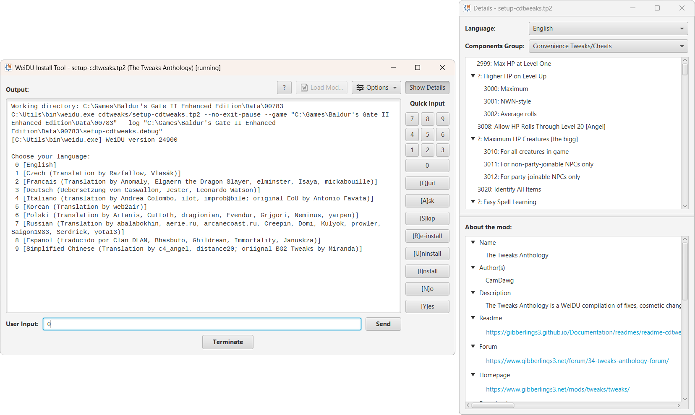

<!--
[](https://github.com/InfinityTools/WeiduModLauncher/releases/latest)
[](https://github.com/InfinityTools/WeiduModLauncher/releases/latest)
[](https://github.com/InfinityTools/WeiduModLauncher/releases)
-->
# WeiDU Mod Launcher
*A graphical front end for WeiDU Mods.*

WeiDU Mod Launcher is a graphical front end for the [WeiDU command line tool](https://github.com/WeiDUorg/weidu), which is used to install mods for Infinity Engine games, such as Baldur's Gate, Icewind Dale or Planescape Torment. The front end is written in Java and uses the JavaFX framework to provide a modern UI.

The launcher provides all functionality of the WeiDU command line interpreter as well as many usability improvements to help with the mod installation task.



## Features

### Tp2 Mod File Association

The installed version of WeiDU Mod Launcher is automatically associated<sup>*</sup> with tp2 mod files which allows you to quickly and conveniently install mods from the file manager without having to deal with setup executables.

<small><em><sup>*</sup> Not available on macOS.</em></small>

### Drag and Drop Support

The launcher also provides drag and drop support. Tp2 files or mod folders themselves can be dropped onto an open launcher instance to initiate the mod installation process if no other mod is currently being installed.

### Detailed Mod Information

The launcher provides detailed information about the currently installed mod, which includes a tree view of available components with filters for mod language and component groups. Moreover, general information about the mod will be shown if available, which includes the mod name and author, a short summary of the mod content, as well as links to the mod's homepage, readme and download location, and optional dependencies.

### Customization

Customization options of the WeiDU Mod Launcher include:
- Toggling between light and dark mode UI on-the-fly
- Setting output text size and character encoding
- Showing visual hints about the installation state
- Warnings about mod conflicts

## Installation

Installation builds are available as installers and portable packages for Windows, Linux and macOS. They can be downloaded from the [Releases](https://github.com/InfinityTools/WeiduModLauncher/releases) section of the project.

## Building from Source

**Required tools:**
- [Gradle Build Tool](https://gradle.org/)
- [Oracle's JDK 21 or later](https://www.oracle.com/de/java/technologies/downloads/), or [OpenJDK 21 or later](https://adoptium.net/temurin/releases/?version=21)

*Note: JDK 21 is automatically provided if an older Java installation is found on the system.*

The following commands will build the application and create packages in the format native to the current platform.

**Windows (installer):**
```
cd WeiduModLauncher
gradlew.bat jpackage
```

**Windows (portable zip):**
```
cd WeiduModLauncher
gradlew.bat portableZip
```

**Linux and macOS (installer):**
```
cd WeiduModLauncher
chmod +x gradlew
./gradlew jpackage
```

**Linux and macOS (portable tarball):**
```
cd WeiduModLauncher
chmod +x gradlew
./gradlew portableTar
```

The resulting package(s) can be found in the `./build/distribution` folder.

The `jpackage` task requires the following software to be installed on the system:
- Windows: [WiX 3.0](https://wixtoolset.org) or later is required.
- macOS: Xcode command line tools are required when the `--mac-sign` option is used to request that the package be signed.
- Linux:
  - For Red Hat Linux, the `rpm-build` package is required.
  - For Ubuntu Linux, the `fakeroot` package is required.

More details can be found in Oracle's [Packaging Tool User's Guide](https://docs.oracle.com/en/java/javase/21/jpackage/packaging-overview.html).

## License

WeiDU Mod Launcher is licensed under the [Apache License, Version 2.0](https://www.apache.org/licenses/LICENSE-2.0).
